# Table of Contents
[LookdevTools](#LookdevTools)  
[Installation](#Installation)   
[Tools](#Tools)   
[&nbsp;&nbsp;&nbsp;&nbsp;Maya Surfacing Projects](#Maya-Surfacing-Projects)  
[&nbsp;&nbsp;&nbsp;&nbsp;&nbsp;&nbsp;&nbsp;&nbsp;Hierarchical Structure](#Hierarchical-Structure)  
[&nbsp;&nbsp;&nbsp;&nbsp;&nbsp;&nbsp;&nbsp;&nbsp;Export](#Export)  
[&nbsp;&nbsp;&nbsp;&nbsp;&nbsp;&nbsp;&nbsp;&nbsp;Instances](#Instances)  
[&nbsp;&nbsp;&nbsp;&nbsp;&nbsp;&nbsp;&nbsp;&nbsp;Substance Painter Udims](#Substance-Painter-and-Udims)  
[&nbsp;&nbsp;&nbsp;&nbsp;Maya Surfacing Viewport](#Maya-Surfacing-Viewport)  
[&nbsp;&nbsp;&nbsp;&nbsp;txmake](#txmake)  
[&nbsp;&nbsp;&nbsp;&nbsp;Material Mapping](#Material-Mapping)  
[&nbsp;&nbsp;&nbsp;&nbsp;&nbsp;&nbsp;&nbsp;&nbsp;Texture Import](#Texture-Import)  
[&nbsp;&nbsp;&nbsp;&nbsp;Katana Surfacing Projects](#Katana-Surfacing-Projects)  
[Macros Gizmos and Templates](#Macros-Gizmos-and-Templates)  
[&nbsp;&nbsp;&nbsp;&nbsp;Studio Lighting](#Studio-Lighting)   
[&nbsp;&nbsp;&nbsp;&nbsp;Gaffer](#Gaffer)   
[&nbsp;&nbsp;&nbsp;&nbsp;&nbsp;&nbsp;&nbsp;&nbsp;GetBoundingBox Node](#LDTGetBoundingBox-Node)     
[&nbsp;&nbsp;&nbsp;&nbsp;&nbsp;&nbsp;&nbsp;&nbsp;AttributeRead Node](#LDTAttributeRead-Node)  
[&nbsp;&nbsp;&nbsp;&nbsp;&nbsp;&nbsp;&nbsp;&nbsp;SurfacingSets Node](#SurfacingSets-Node)   
[&nbsp;&nbsp;&nbsp;&nbsp;&nbsp;&nbsp;&nbsp;&nbsp;ShowMetadata Node](#LDTShowMetadata-Node)  
[&nbsp;&nbsp;&nbsp;&nbsp;&nbsp;&nbsp;&nbsp;&nbsp;Shaderball Node](#LDTShaderball-Node)    
[&nbsp;&nbsp;&nbsp;&nbsp;&nbsp;&nbsp;&nbsp;&nbsp;ShaderView](#ShaderView)   
[&nbsp;&nbsp;&nbsp;&nbsp;&nbsp;&nbsp;&nbsp;&nbsp;ShadingModes](#ShadingModes)     
[&nbsp;&nbsp;&nbsp;&nbsp;Nuke](#Nuke)   
[&nbsp;&nbsp;&nbsp;&nbsp;&nbsp;&nbsp;&nbsp;&nbsp;AOV correct](#AOV-Correct)   
[&nbsp;&nbsp;&nbsp;&nbsp;&nbsp;&nbsp;&nbsp;&nbsp;Lightgroups correct](#Lightgroups-Correct)   
[&nbsp;&nbsp;&nbsp;&nbsp;&nbsp;&nbsp;&nbsp;&nbsp;Lightgroups ContactSheet](#Lightgroups-ContactSheet)   
[&nbsp;&nbsp;&nbsp;&nbsp;Katana](#Katana)   
[&nbsp;&nbsp;&nbsp;&nbsp;&nbsp;&nbsp;&nbsp;&nbsp;Asset Turntable Template](#Asset-Turntable-Template)   
[&nbsp;&nbsp;&nbsp;&nbsp;&nbsp;&nbsp;&nbsp;&nbsp;Material Lookdev](#Material-Lookdev)   
[&nbsp;&nbsp;&nbsp;&nbsp;&nbsp;&nbsp;&nbsp;&nbsp;Render Layers](#Render-Layers)  
[&nbsp;&nbsp;&nbsp;&nbsp;&nbsp;&nbsp;&nbsp;&nbsp;TextureSet Loader](#TextureSet-Loader)   
[&nbsp;&nbsp;&nbsp;&nbsp;&nbsp;&nbsp;&nbsp;&nbsp;Texture Locatization](#Texture-Locatization)   
[&nbsp;&nbsp;&nbsp;&nbsp;&nbsp;&nbsp;&nbsp;&nbsp;Interactive Filters](#Interactive-Filters)   
[&nbsp;&nbsp;&nbsp;&nbsp;&nbsp;&nbsp;&nbsp;&nbsp;Grey Shaders Overrides](#Grey-Shaders-Overrides)   
[Writing tools](#Writing-tools)   
[&nbsp;&nbsp;&nbsp;&nbsp;Example plugin](#Example-plugin)   
[Road Map](#Road-Map)   
[&nbsp;&nbsp;&nbsp;&nbsp;v0.1](#v0.1)   
[&nbsp;&nbsp;&nbsp;&nbsp;What's next](#Whats-next)   
[Credits](#Credits)   

| WARNING: Under development, do not use (yet!) |
| --- |

# LookdevTools
A tool set for maya, katana, gaffer, and nuke for surfacing and look development.  
It aims to be the missing glue between maya (uv prepping and organizing), mari/painter, and maya/katana/gaffer rendering, covering most of the repeatitive tasks, letting you focus on the surfacing.   
Based on my own tool box used for lookdev.

The rendering tools in Maya and Katana are based on Pixar Renderman, Gaffer tools based on Arnold.

# Installation
A few environment variables are required for this tools.
##### Linux
<pre>/ldtenvset.sh</pre>

##### Windows
<pre>Coming soon</pre>

# Tools

## Maya **Surfacing Projects**
This tools allows you to:
* Organize maya meshes into different [**Surfacing Projects**](#What-is-a-surfacing-project?), and [**Surfacing Objects**](#What-is-a-surfacing-object?) .
* Merge meshes for surfacing
* Export alembic files for surfacing
* Import the texture sets back to the **Surfacing Projects** and **Surfacing Objects** in Maya, Katana or Gaffer

### Before we begin
#### textureSet:  
Is a group of channels (textures) that describes a material, or the look of a material. For example, a metal textureSet would have channels for albedo, metalness, roughness, normal, etc
#### Channel:  
Is an individual texture (or several if using udim) that describe a single property of a material. For example: diffuseColor.
#### What is a surfacing object?:  
Is a group of meshes that will share a textureSet, for example: an armchair's leather parts, or the armchair's wooden parts.
#### What is a surfacing project?:  
Is a group of **Surfacing Objects**, for example: The armchair.
This is usually what you will want to bring into your surfacing software, where you will have your Armchair leather and wooden parts as separated meshes.
You can have as many **Surfacing Projects** as you want, to surface separately.   

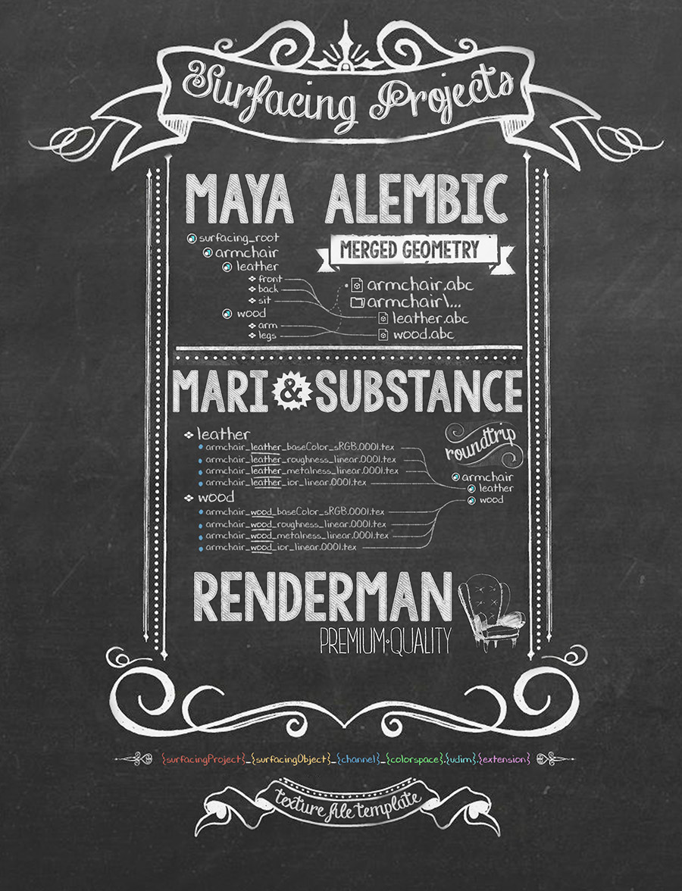
Who said a workflow diagram can't look hip.

### Hierarchical Structure
#### example
```
surfacing_root
    room 
        Floor
            wood
            rug
        walls
            wallFront
            wallLeft
            skirtings
    armChair
        leather
            back
            sit
            sides
        wood
            armrests
            legs
        blanket
            fabricSquare
            edgingFabric
```


#### Export
When exporting, the tools merge the meshes inside a surfacing object.
Following the example from above: It will merge all the Armchair's leather parts, as a single mesh called "leather".  
The tool then reverts back to your original (non merged) scene.
The armchair example from above exported. 


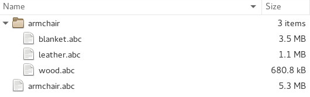

##### Export subdivisions
Select the subdivision level to apply before exporting from the Surfacing Tool UI.

##### Subdivions and memory
Usually this would not be a problem. However, if you are working on a heavy asset or scene (for ei the pixarCabin), you might find memory consumption spikes at export time due to subdivided meshes.
If this is an issue, you can either export each surfacing_project individually, or optimize your scene:
* Check for high poly count objects in your scene
* Avoid adding Instances to **Surfacing Objects**, instead add the instance source.

```
As Mari is optimized for one single mesh, **Surfacing Objects** count inside a surfacing project is important.   
The amount of SurfacingObjects can impact your performance. The more SurfacingObjects you have inside a single  
surfacing project, the slower Mari will be.
It is not recommended using more than 8 **Surfacing Objects** per surfacing project for Mari.
```

##### Instances
When working with instanced meshes, as much as posible, add the instance source to the **Surfacing Objects**.   
Notice in this set maya viewport -that was entirely built with instances- how only the instance sources are added to the **Surfacing Objects**, and not the set itself.  

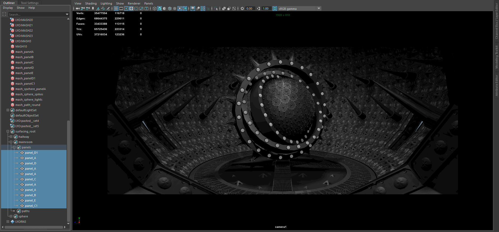

##### Substance Painter and Udims
When using the Surfacing Project alembic file, and Substance Painter with udim:
*  All meshes inside a Surfacing Object, must be contained inside a single udim  
*  **Surfacing Objects** should not have overlapping Uvs.   

## Maya Surfacing Viewport

Assigns materials, or wireframe colors to **Surfacing Projects** or **Surfacing Objects** to visualize them in the Viewport.   
Colors will match across applications.  

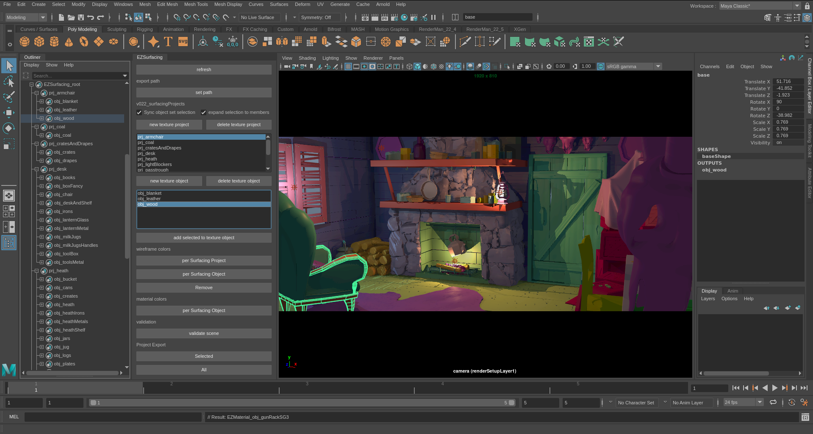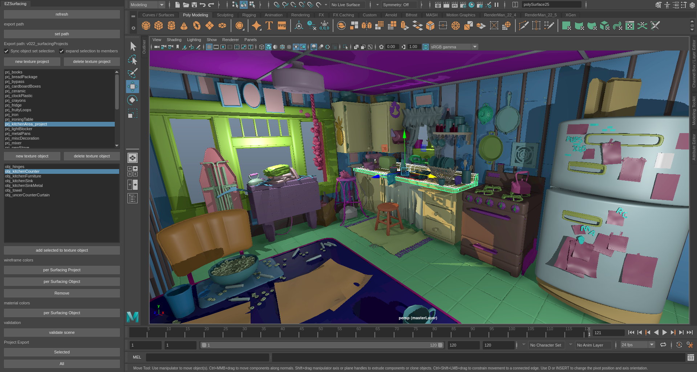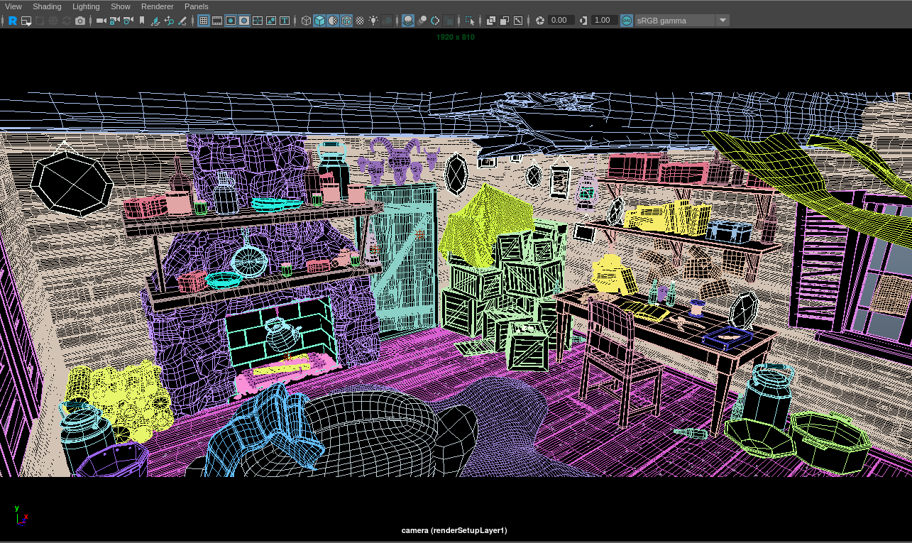

## txmake

There are plenty of txmake tools available.  
What makes this tool handy is:
- multiprocessing: Run as many simultaneous txmakes as you want. This gives a performance boost of up to 9 times faster (as tested) when converting many textures at once.
- extra arguments list.
- search texture files recursively in a given folder.

## Texture Import

Find and import textures into your maya scene. Search in folders is recursive.

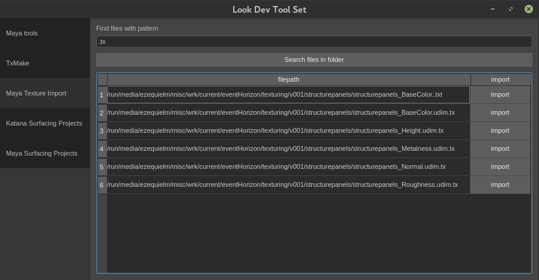

## Material Mapping

Click on Search files in folder, and the tool will -for each texture file- load its surfacing project, surfacing_object, colorspace, textureset_element name as well as what shader_plug it should be connected in a PxrSurface shader, and group them together by udim.  
Make any assignment changes in this excel like interface before importing.   
<pre>
{surfacing_project}_{surfacing_object}_{textureset_element}_{colorspace}.{UDim}.{extension}
For example:
   room_chair_baseColor_sRGB.1001.exr
</pre>

206 Textures, from 6 Substance Painter textureSets imported to the Pixar cabin with a single click.

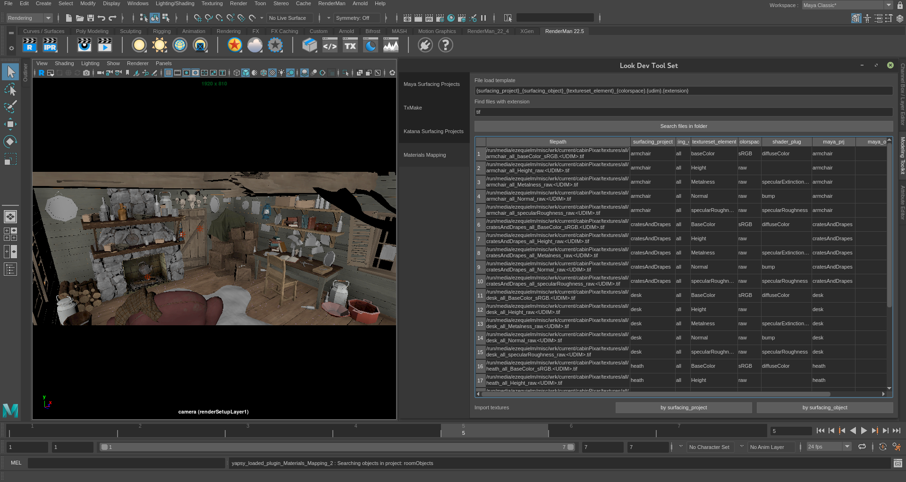

###### Notes
* If your file name has the {colorspace} token somewhere, the tools will create the file nodes with the correct colorspaces. OCIO partially supported, only the commonly used colorspaces.  
Valid colorspaces are:
    * sRGB
    * raw
    * linear
* The tool uses fuzzy string matching to give naming some flexibility to errors or differences, like capital letters, camel casing, or different spellings.

## Katana Surfacing Projects

Creates collections and materials based on the **Surfacing Projects** and **Surfacing Objects** found in the scene graph.  
It can also assign colors in the viewport, matching the colors of the maya Viewport materials and wireframe.

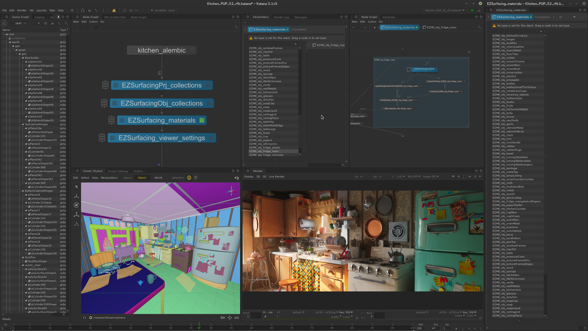

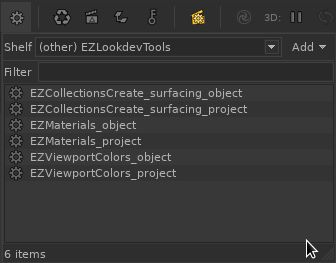

###### Note
A node from the NodeGraph must be selected, this node will be used as the scene point where to cook and examine the scene graph locations.   

Collections, viewport colors, and material assignments are based on attribute values at locations as in.
```
/root/world//*{attr("geometry.abcUser.myCustomAttribute") == value
```
The attributes used from this tools are standard alembic user properties:
```
abcUser.surfacing_project
abcUser.arbitrary.surfacing_object
```
It can also be used to create collections of all unique values for any given attribute.

# Macros Gizmos and Templates

## Studio Lighting
A Studio ligthrig and a nuke template is available for Gaffer.

WIP IMAGE
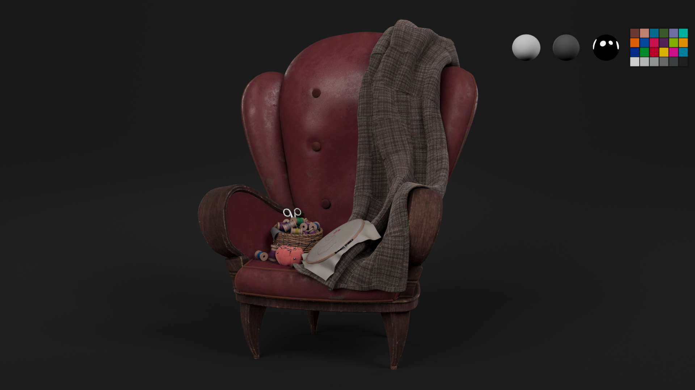

```
/plugis/gaffer/templates/studioLighting.gfr
```

## Gaffer
My Gaffer playground.

### LDTGetBoundingBox Node
Exposes the boundingbox (local space) on read only plugs.
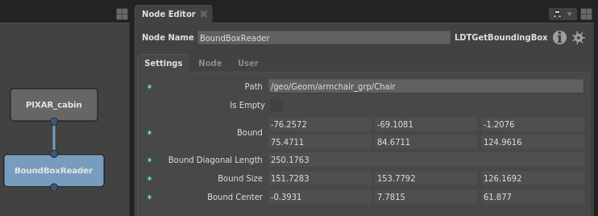  

### LDTAttributeRead Node
Exposes the attribute value on a read only plug.
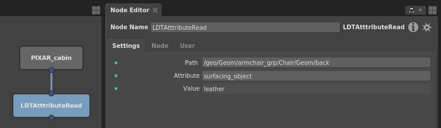  

### SurfacingSets Node
Creates Sets for each unique value for a given attribute.
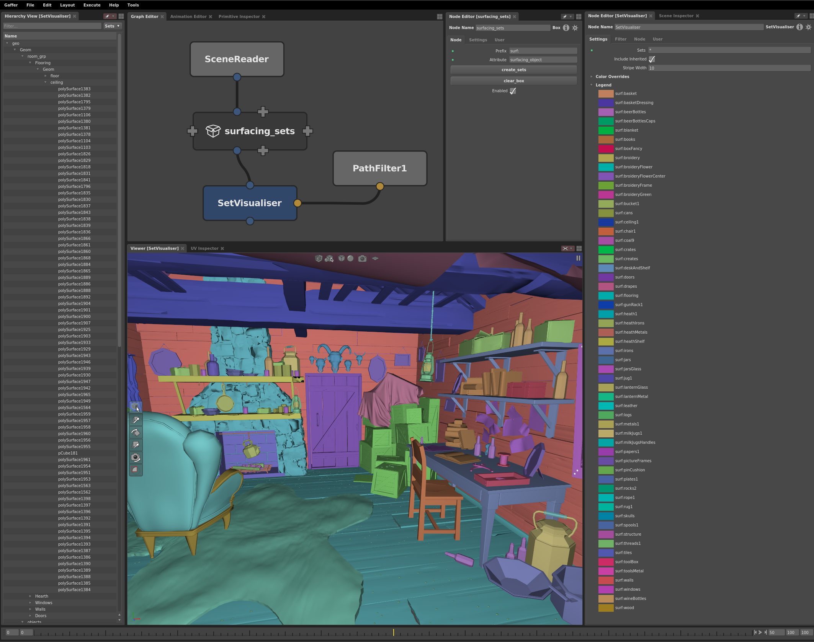  

### LDTShowMetadata Node
Search metadata keys with partial matching, and overlays on the image.
For ie: **/stats/geo** will display all /arnold/**stats/geo...**, **samples** will display all keys that contain the word **samples**.
Leave a blank field, and it will display all available keywords

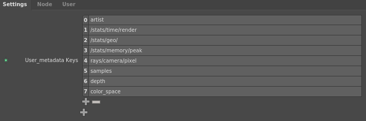
 

### LDTShaderBall Node
A shader ball scene, Shader, displacement plugs and subdiv options plug.
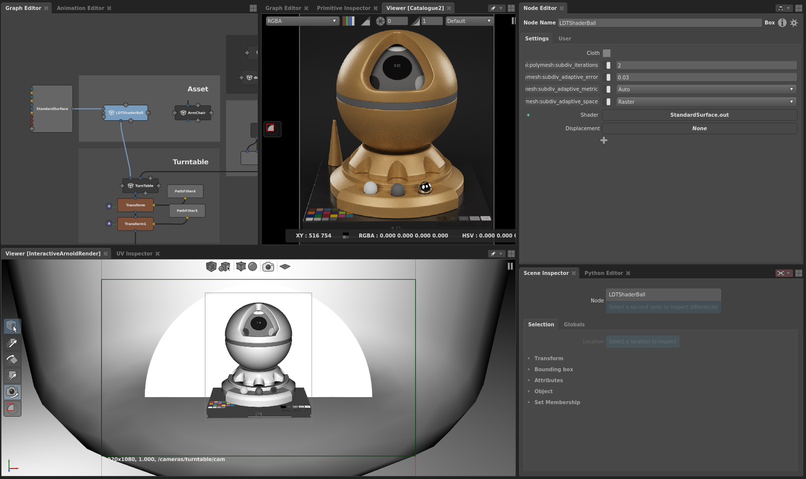  

### ShaderView
Replaces the default ShaderBall scene node in the ShaderView, with the pixar Teapot or your own geometry.   
 
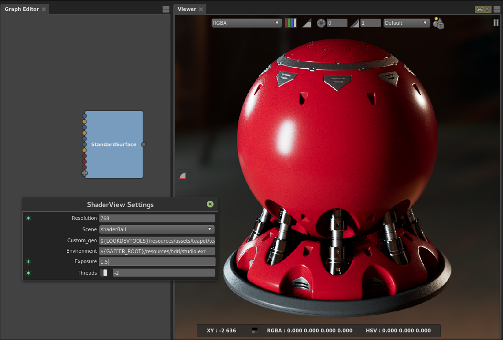   
This ShaderView scene, is also available as the ArnoldLDTShaderBall Node.


### ShadingModes
#### Viewer diagnostic shading modes
##### LDTPattern2k and LDTPattern4k
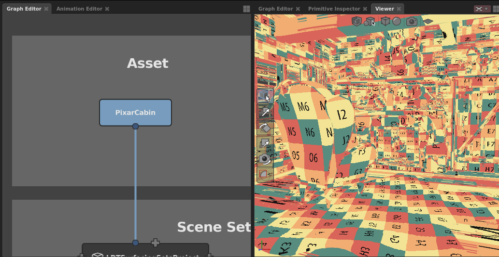   
This ShaderView scene, is also available as the ArnoldLDTShaderBall Node.  


## Nuke
### AOV Correct
Select a nuke layer, and color correct it

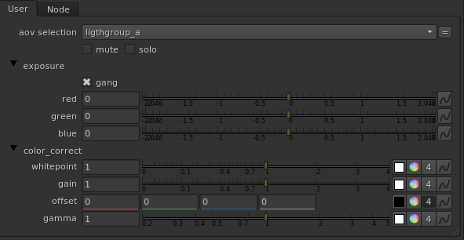

### Lightgroups Correct
Select a lightgroup layer from the preset menu, and mute/solo/color correct it

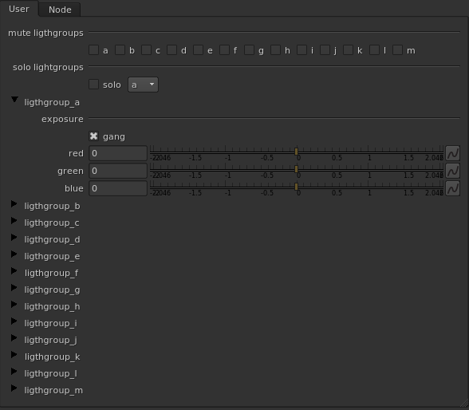

### Lightgroups contactSheet
Creates a contact sheet of all the default lightgroups.  
Two grid options available 1x5, and 1x12

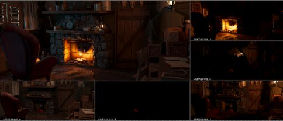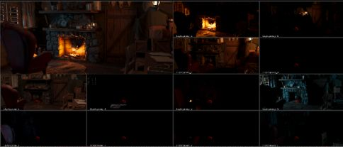

###### Note
Although you can select all the inputs, by default it expects ligthgroups named as in: lightgroup_a, lightgroup_b, lightgroup_c, and so on.

## Katana

### Asset Turntable Template
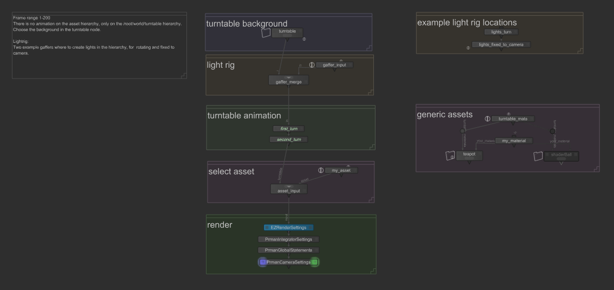

### Material LookDev
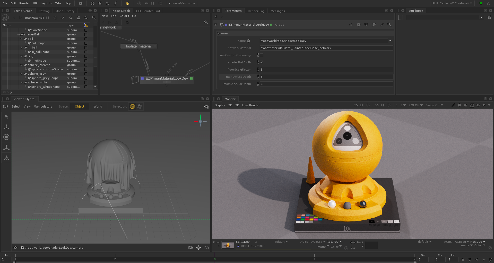

Includes the pixar teapot, and a shaderball as generic assets for material look dev

### TextureSet Loader
Loads multiple texture files using tokens or keywords from a single node.

Using the ```<channel>``` keyword for each channel, and ```_MAPID_``` for renderman.  
It also accepts a manifold input (of any type), for tiling.

```
Metal_PaintedSteelBase_<channel>.tex   
woodenTable_<channel>._MAPID_.tex
```

Each channel (for ie: baseColor, or normal) can be added to the list.

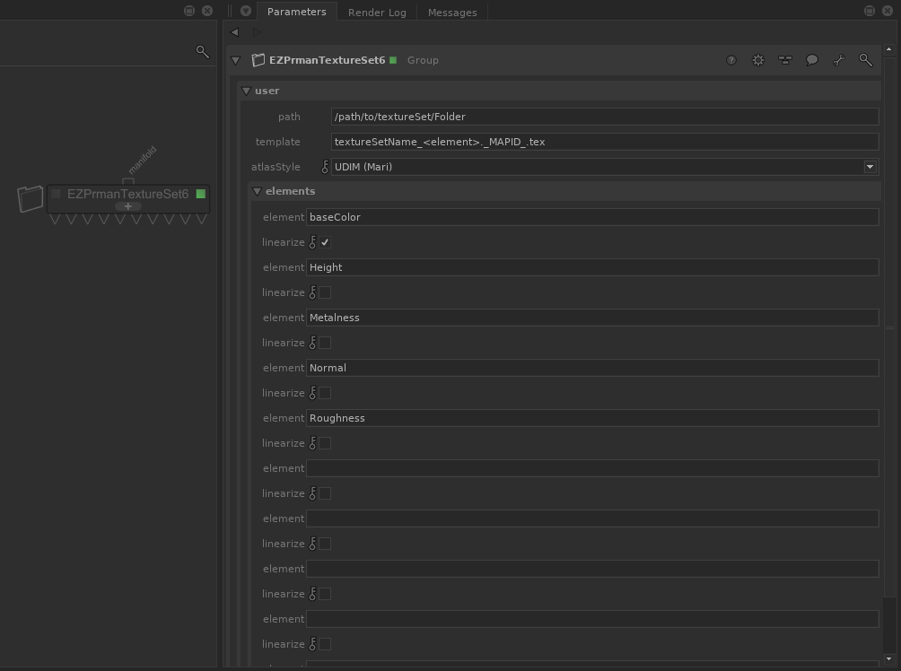

### Render Layers
Render layers additive creation with the usual parameters we all learned to love (or to live with!).  

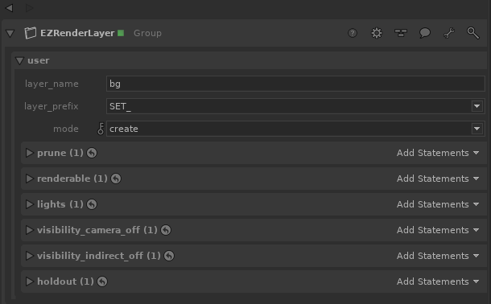

By setting the preffix, and a wildcard ```*```, the settings will apply to all layers with that prefix.  
Or ```*tree*``` and the settings will apply to any renderlayer with that prefix, that contains the word ```tree``` somewhere in the name.  
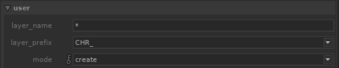

All the render layers settings are stored in the scene graph as a render layer type location.  
All settings (paths, CEL and collections) get flattened as a single CEL expressions.   

Inspect your renderlayer setup CELs in the scene graph.  

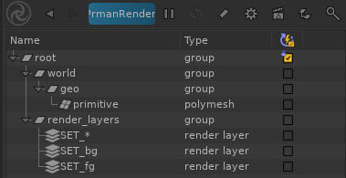

RenderLayer nodes work in conjuntion with a variable set name. Branch the layer down the graph when its more convinient for your scene.  

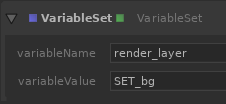

#### Aggregate mode
In aggreate mode, you can add and remove objects (with CEL, collections, or paths) from an already set up render layer coming from above in the NodeGraph. 

Note the ```/root/world/thisOtherLight``` in the aggregate mode and how it gets added to the original CEL expression in the render layer location attributes. 

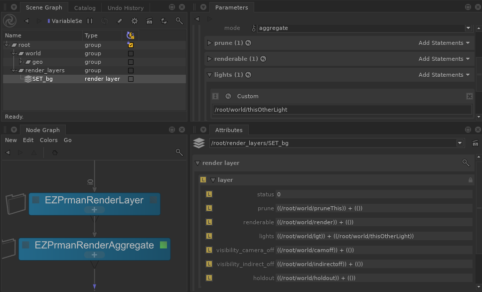

### Texture localization
Opscript to search and replace paths in all PxrTexture nodes at ```.material.nodes```

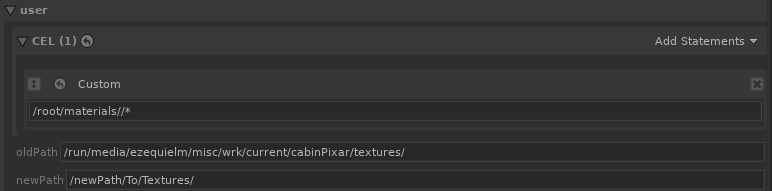

###### Note
Point this Opscript to /root/world/geo//* if kfls are assigned to the objects.  
Or to /materials//* if the materials are local to your scene.

### Interactive Filters
Miscelaneous interactive filters for renderman 22
* Resolution half, third
* Quality presets
* Save n threads
* Scanning options
* Use it
* Integrators: occlusion, occlusion with albedo, direct lighting, and default
* Subdmeshes to poly (aka: ignore subdivisions)
* Grey shader override, and diffuseColor override for all materials

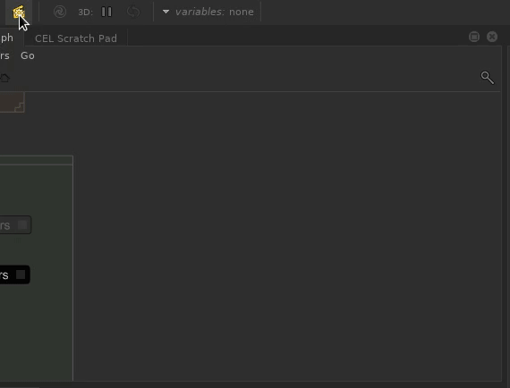

##### Grey shaders overrides
###### grey_shader:
Replaces all your shaders with a 0.18 grey standard material. 

###### grey_albedo:
This filter overrides only the diffuseColor with a 0.18 grey color.  
Keeping all other materials features values, like specular, roughness, normals, diplacements, etc.

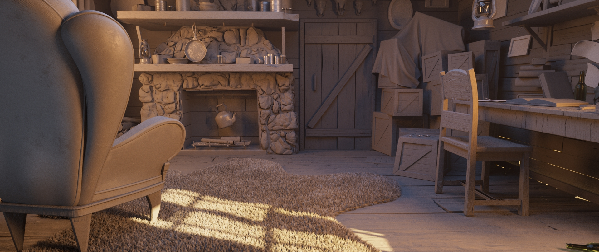

## Writing tools
### Developing Plugins
The toolset is based on a plugin arquitecture.  
See yapsy documentation for more info   
http://yapsy.sourceforge.net/

### Example plugin
ExamplePlugIn.plugin_layout QtWidget is what you need to populate in order to add and show an UI.

<pre>python/ldtplugins/example_plugin/__init__.py</pre>

```

from ldt import context

class ExamplePlugIn(IPlugin):
    '''Example plugin.'''
    name = "Example Plugin"

    plugin_layout = None

    def __init__ (self):
        dcc = context.dcc()
        # Replace 'Maya' with required dcc for plugin
        if dcc == 'Maya':
            logger.info('ExamplePlugIn loaded')
            # Add your dcc imports here
            self.build_ui()
        else:
            logger.warning(
                'ExamplePlugIn  not loaded, dcc libs not found')
            self.plugin_layout = QtWidgets.QWidget()
            self.label_ui = QtWidgets.QLabel(self.plugin_layout)
            self.label_ui.setText(
                'ExamplePlugIn\nPlugin not available in this application')

    
    def build_ui(self):
        '''Builds the ui for the plugin'''
        self.plugin_layout = QtWidgets.QWidget()
        plugin_layout = QtWidgets.QVBoxLayout()

        #UI Here

        # Set main layout
        self.plugin_layout.setLayout(plugin_layout)

```

<pre>python/ldtplugins/example_plugin.yapsy-plugin</pre>
```
[Core]
Name = Example plugin
Module = example_plugin

[Documentation]
Author = Ezequiel Mastrasso
Version = 1.0
Website = //ezequielm.com
Description = This is an example plugin configure, with UI entry points.
```
## Road map
[Project Board](https://github.com/ezequielmastrasso/EZLookdevTools/projects/1)
### v0.1
[Milestone Board](https://github.com/ezequielmastrasso/EZLookdevTools/projects/1?card_filter_query=milestone%3Av0.1)
* Bridge the gap between all supported applications, while giving the minimum amount of tools to do so.
* Multiprocessing package to batch commmands.
* Minimum required Renderlayers, AOVs, viewport viz tools for maya and katana.
* Minimum required Nuke gizmos.
* Minumin required Mari gizmos for textureset library imports and tiling.
* Mari and Painter channel preset creation.
* Mari and Painter channel export presets.
* Maya and Katana turntable lightrigs for look dev
* Nuke comp templates for lookdev.


### What's Next
* Some code refactoring, and clean up to do 
* Multiprocessing package
* Maya uv's viewport utilities
* Maya lighting, lightgroups, and aov tools
* Maya and Katana turntable lightrigs
* Nuke gizmos upgrade
* Katana texture set loader as a supertool
* Katana aov manager as a supertool

## Credits
### Open Source Packages Used

```
fuzzywuzzy   
lucidity   
yapsy   
Qt.py
```   

### Shader Ball
Mathieu Maurel   
[shader ball](https://www.artstation.com/artwork/wKveZ)

### Texture Patterns
Elias Wick   
[Free checket pattern texture](https://polycount.com/discussion/186513/free-checker-pattern-texture)

### Pixar cabin
Surfacing, lighting, and rendering done by Ezequiel Mastrasso.

### Pixar kitchen
Surfacing, lighting, and rendering done by Ezequiel Mastrasso.  
This images are part of the original speed surfacing exercise that give birth to these tools.  

However the look and style is based on the original winner of the pixar Kitchen challenge  
Fabio Rossi Sciedlarczyk (scied)

### Event horizon 
Modeling, Surfacing, lighting, and rendering done by Ezequiel Mastrasso.

### Pixar Teapot model
[Official Swatch](https://renderman.pixar.com/official-swatch)

### HDRI
[HDRI Haven](https://hdrihaven.com)

### Icons
[thenounproject](https://thenounproject.com/search/?q=file)